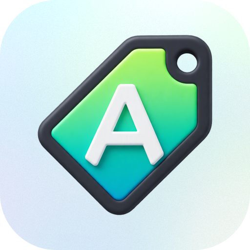
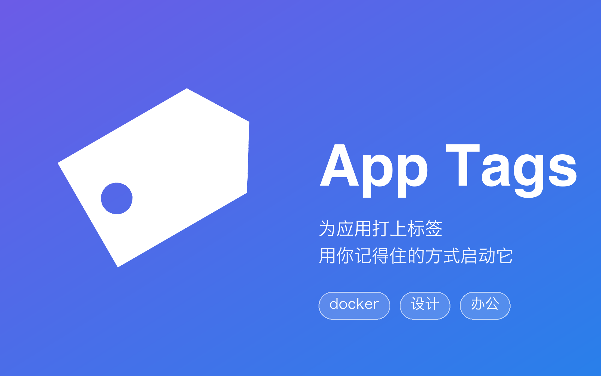

<p align="center">
  
</p>

<h1 align="center">App Tags</h1>

<p align="center">为 macOS 应用打上自定义标签，用你记得住的方式找到并启动它们。</p>



App Tags 是一个 Raycast 扩展，解决一个常见痛点：Mac 上装的应用越来越多，很多应用连名字都想不起来。给应用贴上自定义标签（别名）后，只需要输入 `docker`、`设计`、`办公` 这样的关键词，就能把相关应用一次性列出来并启动。

每个应用可以挂任意多个标签，标签与应用之间是多对多关系。

## 功能特性

- **标签搜索启动**：按应用名或任意标签搜索应用，回车直接启动；支持多关键词（空格分隔，全部命中）；结果按「标签精确命中 > 名称开头 > 标签包含 > 名称包含」智能排序
- **分区展示**：未搜索时列表分为「已打标签」与「全部应用」两区，打过标签的应用优先触达
- **Fallback Command**：支持作为 Raycast 主搜索的回退命令，主窗口输入的文字会自动带入搜索结果
- **标签自动配色**：每个标签按名称稳定映射到固定颜色，亮色/暗色主题下都清晰可辨
- **搜索或新建，一步打标**：打标界面是单个搜索框 —— 输入即过滤已有标签，无匹配时第一项自动变为「新建标签」，回车完成创建并打标
- **标签管理中心**：以标签为中心的视图，每个标签下有哪些应用一目了然；支持全局重命名（撞名自动合并）、全局删除（二次确认）
- **双向维护归属**：从应用侧（`⌘T`）和从标签侧（`⌘N`）都能给应用打标
- **残留清理**：自动识别已卸载应用的残留标签，一键清理
- **导入 / 导出**：标签可导出为 JSON 文件备份或迁移；导入支持「合并」（保留现有、累加导入）与「覆盖」（清空后导入）两种方式，导入前二次确认
- **数据本地存储**：标签数据保存在 Raycast LocalStorage，以应用 bundleId 为键，应用改名/移动位置不影响标签

## 命令一览

| 命令 | 说明 |
| --- | --- |
| **Search Applications** | 主命令。列出全部应用，按名称或标签搜索并启动，支持 `query` 参数与 Fallback 模式 |
| **Manage App Tags** | 标签管理中心。标签 → 应用的两级视图，全局重命名/删除标签，反向打标 |

## 安装

本扩展未上架 Raycast Store，通过源码本地安装（标签数据保存在本机 Raycast LocalStorage，全程无需联网）。从 [最新 Release](https://github.com/liuxingyu521/raycast-extension-app-tags/releases) 下载 zip 解压，或 clone 仓库：

```bash
git clone git@github.com:liuxingyu521/raycast-extension-app-tags.git
cd raycast-extension-app-tags
npm install
npm run dev    # Raycast 会自动装入本扩展，看到命令后即可停掉 dev 进程
```

装入后命令会长期保留在 Raycast 中，可正常设置别名、快捷键与 Fallback Command。建议开发或更新后跑一次 `npm run build`，日常使用的就是优化后的生产构建。

要求 Node.js ≥ 20.8 与最新版 Raycast。

## 使用方式

### 搜索并启动应用

1. 呼出 Raycast，输入别名（建议设置为 `a`），按 `Tab` 进入参数模式
2. 输入标签名，如 `docker`，回车
3. 列表展示所有相关应用，回车启动

也可以把 Search Applications 设为 Fallback Command（Raycast 中运行 `Manage Fallback Commands` 启用），主搜索无结果时直接回车进入。

### 给应用打标签

在 Search Applications 列表中选中应用：

- `⌘T` —— 快速打标：搜索已有标签或输入新标签名，回车完成
- `⌘⇧T` —— 管理该应用的全部标签（删除单个、清空）

### 标签集中管理

打开 **Manage App Tags**：

- 第一层列出所有标签及各自的应用，按应用数量排序
- 回车进入标签详情，查看/启动该标签下的应用
- `⌘R` 全局重命名标签、`⌘⇧⌫` 全局删除标签（确认框会列出受影响应用）
- 标签详情页内 `⌘N` 把更多应用加入当前标签，可连续添加
- `⌘⇧E` 导出全部标签为 JSON 文件；`⌘I` 从 JSON 文件导入（可选合并或覆盖）

## 快捷键速查

| 快捷键 | 位置 | 作用 |
| --- | --- | --- |
| `⌘T` | 应用列表 | 快速添加标签（搜索或新建） |
| `⌘⇧T` | 应用列表 | 管理当前应用的全部标签 |
| `⌘N` | 标签详情 | 把应用加入当前标签 |
| `⌃X` | 标签编辑页 / 标签详情 | 删除单个标签 / 从该应用移除当前标签 |
| `⌘R` | 标签总览 | 全局重命名标签 |
| `⌘⇧E` | 标签总览 | 导出全部标签到 JSON 文件 |
| `⌘I` | 标签总览 | 从 JSON 文件导入标签（合并 / 覆盖） |
| `⌘⇧⌫` | 标签总览 / 标签编辑页 | 全局删除标签 / 清空应用标签 |
| `⌘F` | 任意应用条目 | 在 Finder 中显示 |

## 本地开发

```bash
npm install
npm run dev      # 开发模式，Raycast 热重载加载扩展
npm run build    # 生产构建
npm run lint     # ESLint + Prettier + 扩展清单校验
```

## 项目结构

```
├── package.json          # 扩展清单（命令、参数定义）
├── assets/icon.png       # 扩展图标
└── src/
    ├── search-apps.tsx   # Search Applications 命令
    ├── manage-tags.tsx   # Manage App Tags 命令（标签中心视图）
    ├── edit-tags.tsx     # 单应用标签编辑页 + 「搜索或新建」打标组件
    └── lib/
        ├── tags.ts       # 标签存取层（LocalStorage，以 bundleId 为键）
        ├── transfer.ts   # 导入 / 导出（JSON 序列化、校验、文件选择）
        └── colors.ts     # 标签配色（按名称稳定映射到固定颜色）
```

## 数据模型

标签数据存储于 Raycast LocalStorage，键为 `appTags.v1`：

```json
{
  "com.docker.docker": ["docker", "容器"],
  "com.orbstack.OrbStack": ["docker"]
}
```

应用标识优先使用 bundleId，取不到时退化为应用路径。

## 发布说明

```bash
npm run publish            # 用 package.json 当前版本号发版
npm run publish -- patch   # 先 bump 修订号（如 1.0.0 → 1.0.1）再发版，也可用 minor / major
```

命令会依次执行 lint 校验与生产构建，然后打 `v*` 标签并推送；GitHub Actions 检测到标签后自动打包 zip 并创建 Release。

## License

MIT
